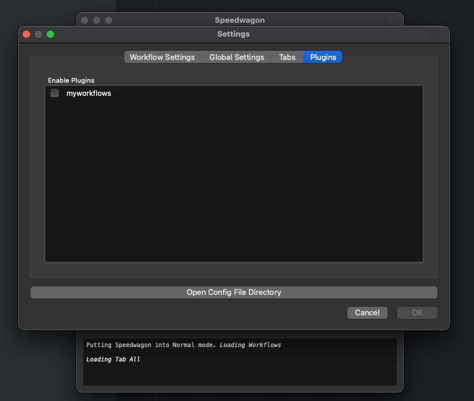

===============
Getting Started
===============

Set up the Development Environment
++++++++++++++++++++++++++++++++++

1) Create a new Python directory for your python project to run

2) Create a virtual env and activate it

    On Mac or Linux terminal:

        .. code-block:: console

            $ python3 -m venv venv
            $ source venv/bin/activate

    On Windows command line:

        .. code-block:: doscon

            > py -m venv venv
            > venv\Scripts\activate

3) Create a pyproject.toml file

    The pyroject.toml file should have at least a :strong:`[project]` section with the following keys defined:

    * `name`_: This should be the name of your plugin
    * `version`_: The starting version of your plugin
    * `dependencies`_: Include at least "speedwagon"

    .. _name: https://packaging.python.org/en/latest/guides/writing-pyproject-toml/#name
    .. _version: https://packaging.python.org/en/latest/guides/writing-pyproject-toml/#version
    .. _dependencies: https://packaging.python.org/en/latest/guides/writing-pyproject-toml/#dependencies-and-requirements

    For example:

    .. code-block:: toml

        [project]
        name = "myspeedwagonplugin"
        version = "0.1.0"
        dependencies = [
            "speedwagon"
        ]

4) Create a Python package.

    This should be the same name that you used for the project in the pyproject.toml file.
    At this point your project should look like this.
    ::

        project_root_dir/
        ├── myspeedwagonplugin/
        │   └── __init__.py
        ├── pyproject.toml
        └── venv/

5) Generate plugin hook file with registered_workflows() function.

    There are no strict requirements for the naming of this file outside of ones that Python requires. For my example,
    I will use hook.py. Create this file inside the Python package folder you just created.

    Use the following code as a starting point.

    .. code-block:: python

        # hook.py
        import speedwagon
        from typing import Dict, Type

        @speedwagon.hookimpl
        def registered_workflows() -> Dict[str, Type[speedwagon.workflow]]:
            """Register workflows with the plugin.

            Returns:
                Returns a dictionary with the name of the workflow for the key and the
                class of the workflow for the value.
            """
            return {}

    At this point your project should look like this.
    ::

        project_root_dir/
        ├── myspeedwagonplugin/
        │   ├── __init__.py
        │   └── hook.py
        ├── pyproject.toml
        └── venv/

6) Register this hook for Speedwagon

    To register your plugin so that speedwagon can find it, edit the pyproject.toml file by adding a new
    :strong:`[project.entry-points.'speedwagon.plugins']` section after the :strong:`[project]` section. Here, provide a name
    for the workflows and the import path to the hook file containing the :code:`registered_workflows()` function.

    .. code-block:: toml

        [project]
        name = "myspeedwagonplugin"
        version = "0.1.0"
        dependencies = [
            "speedwagon==0.3.1"
        ]

        [project.entry-points.'speedwagon.plugins']
        myworkflows = 'myspeedwagonplugin.hook'

7) pip install in editing mode

    Use "pip install" with the "-e" flag to install your plugin so that speedwagon can find it while you are
    developing. :strong:`Make sure you have activated your virtual env from step 1 first .`

    .. code-block:: console

        (venv) $ pip install -e .

You are done setting up the Speedwagon plugin development environment.

Installing the GUI Framework
++++++++++++++++++++++++++++

Speedwagon does not preinstall the GUI dependency because speedwagon can run without a desktop gui.
But if you are developing a plugin, you probably want to install the gui. It's much easier that way.

.. code-block:: console

    $ pip install PySide6
    Collecting PySide6
      Obtaining dependency information for PySide6 from https://files.pythonhosted.org/packages/1e/a4/8fd2f8f1d34db1f44a99d4f994e9f81498960161547319b7ce6258acd6bd/PySide6-6.7.0-cp39-abi3-macosx_11_0_universal2.whl.metadata
      Downloading PySide6-6.7.0-cp39-abi3-macosx_11_0_universal2.whl.metadata (5.3 kB)
    Requirement already satisfied: shiboken6==6.7.0 in ./venv/lib/python3.12/site-packages (from PySide6) (6.7.0)
    Collecting PySide6-Essentials==6.7.0 (from PySide6)
      Obtaining dependency information for PySide6-Essentials==6.7.0 from https://files.pythonhosted.org/packages/5d/81/f64c263851956139cc7012f39d0d174464a2618015962c9ecc82d751330a/PySide6_Essentials-6.7.0-cp39-abi3-macosx_11_0_universal2.whl.metadata
      Downloading PySide6_Essentials-6.7.0-cp39-abi3-macosx_11_0_universal2.whl.metadata (3.7 kB)
    Collecting PySide6-Addons==6.7.0 (from PySide6)
      Obtaining dependency information for PySide6-Addons==6.7.0 from https://files.pythonhosted.org/packages/d9/f6/6a95948f729e0f96ba249482b445fca02bf435024f723d59943e2f699942/PySide6_Addons-6.7.0-cp39-abi3-macosx_11_0_universal2.whl.metadata
      Downloading PySide6_Addons-6.7.0-cp39-abi3-macosx_11_0_universal2.whl.metadata (4.0 kB)
    Downloading PySide6-6.7.0-cp39-abi3-macosx_11_0_universal2.whl (525 kB)
       ──────────────────────────────────────── 525.3/525.3 kB 4.2 MB/s eta 0:00:00
    Downloading PySide6_Addons-6.7.0-cp39-abi3-macosx_11_0_universal2.whl (273.7 MB)
       ──────────────────────────────────────── 273.7/273.7 MB 8.1 MB/s eta 0:00:00
    Downloading PySide6_Essentials-6.7.0-cp39-abi3-macosx_11_0_universal2.whl (153.4 MB)
       ──────────────────────────────────────── 153.4/153.4 MB 12.2 MB/s eta 0:00:00
    Installing collected packages: PySide6-Essentials, PySide6-Addons, PySide6
    Successfully installed PySide6-6.7.0 PySide6-Addons-6.7.0 PySide6-Essentials-6.7.0

Launch speedwagon

.. code-block:: console

    $ python -m speedwagon

You should now be able to see and load your plugin within the Speedwagon application.

Right now the plugin contains no workflows. Let's fix that.

Build New Speedwagon Workflow
+++++++++++++++++++++++++++++

1) Create a new Python file.
    This can be a file named anything as long as it ends in a .py

2) Import speedwagon.Workflow
    In the new file, import speedwagon

    .. code-block:: python

        # workflows.py
        import speedwagon

3) Create a new class that subclasses :py:class:`speedwagon.Workflow <speedwagon.Workflow>`.

    Add a name and description class attributes. The name attribute should be how you want the workflow to list it
    self. The description field should be a small summary of what it does and explain the workflow parameters

    .. code-block:: python

        # workflows.py
        import speedwagon

        class DirectoryContentWorkflow(speedwagon.Workflow):
            name = "Show Folder Content"
            description = """Locates the content of a folder

        input: path to a directory
        """

4) Add any user input arguments.

    While this step is technically optional, you will most likely need to get some input from the user. To add an
    input section to the workflow, override the :py:meth:`job_options() <speedwagon.Workflow.job_options>` method.

    .. code-block:: python

        class DirectoryContentWorkflow(speedwagon.Workflow):
            ...
            def job_options(self):
                return [
                    speedwagon.workflow.DirectorySelect("input"),
                ]

5) Locate information about a job.

    You need to implement :py:meth:`discover_task_metadata <speedwagon.Workflow.discover_task_metadata>` abstract method for any class derived from :py:class:`speedwagon.Workflow() <speedwagon.Workflow>`.
    This method is for gathering any information that will be used for creating subtasks.

    .. code-block:: python

        class DirectoryContentWorkflow(speedwagon.Workflow):
            ...
            def discover_task_metadata(self, initial_results, additional_data, **user_args)
                my_input = user_args['input']
                return [
                    {
                        "path": file.path,
                        "name": file.name
                    } for file in os.scandir(my_input)
                ]

6) Write a Subtask Class

    Unless your workflow includes any prewritten subtask, you will need to create your own.

    Create a new class the that inherits from :py:class:`speedwagon.tasks.Subtask <speedwagon.tasks.Subtask>`. The only method that is required is the :py:meth:`work() <speedwagon.tasks.Subtask.work>`
    method. You can implement the class however you want.

    .. code-block:: python

        class GetFileInformation(speedwagon.tasks.Subtask):

            def __init__(self, file_name, file_path):
                self.file_name = file_name
                self.file_path = file_path

            def work(self):
                self.log(f"Reading {self.file_name}")
                file_stats = os.stat(self.file_path)
                self.set_results(
                    {
                        "name": self.file_name,
                        "size": file_stats.st_size
                    }
                )
                return True

7) Assign data located in :py:meth:`discover_task_metadata() <speedwagon.Workflow.discover_task_metadata>` to the :py:class:`Subtask <speedwagon.tasks.Subtask>`

    .. code-block:: python

        class GetFileInformation(speedwagon.tasks.Subtask):
            ...
            def create_new_task(self, task_builder, **job_args):
                task = GetFileInformation(
                    file_name=job_args['name'],
                    file_path=job_args['path']
                )
                task_builder.add_subtask(task)

Example of a complete :py:class:`Workflow <speedwagon.Workflow>` and :py:class:`Subtask <speedwagon.tasks.Subtask>` full implemented with TypeHints added.

.. code-block:: python

    # workflows.py
    import speedwagon
    import os
    from typing import List, Any, Dict, Type

    class DirectoryContentWorkflow(speedwagon.Workflow):
        name = "Show Folder Content"
        description = """Locates the content of a folder

        input: path to a directory
        """

        def discover_task_metadata(
            self,
            initial_results: List[Any],
            additional_data: Dict[str, Any],
            **user_args
        ) -> List[dict]:
            my_input = user_args['input']
            return [
                {
                    "path": file.path,
                    "name": file.name
                } for file in os.scandir(my_input)
            ]

        def create_new_task(self, task_builder: speedwagon.tasks.TaskBuilder, **job_args) -> None:
            task = GetFileInformation(
                file_name=job_args['name'],
                file_path=job_args['path']
            )
            task_builder.add_subtask(task)

        def job_options(self) -> List[AbsOutputOptionDataType]:
            return [
                speedwagon.workflow.DirectorySelect("input"),
            ]

        @classmethod
        def generate_report(
            cls,
            results: List[Result],
            **user_args
        ) -> Optional[str]:
            report_header_lines = [
                f'The content of: {user_args["input"]}',
                ""
            ]

            report_content_lines = [
                f'  * {result.data["name"]} -> size: {result.data["size"]}'
                for result in results
            ]

            return "\n".join(report_header_lines + report_content_lines)

    class GetFileInformation(speedwagon.tasks.Subtask):

        def __init__(self, file_name: str, file_path: str) -> None:
            self.file_name = file_name
            self.file_path = file_path

        def work(self) -> bool:
            self.log(f"Reading {self.file_name}")
            file_stats = os.stat(self.file_path)
            self.set_results(
                {
                    "name": self.file_name,
                    "size": file_stats.st_size
                }
            )
            return True

Register Workflow as Part of Your Plugin
++++++++++++++++++++++++++++++++++++++++

Open the python file that contains the :code:`registered_workflows()` function.
In the dictionary that returns from that function add an entry. This entry should use name of the workflow for the
key and the value should be the class to the workflow.

For example:

if your project files are as such...
    ::

        project_root_dir/
        ├── myspeedwagonplugin/
        │   ├── __init__.py
        │   ├── workflows.py
        │   └── hook.py
        ├── pyproject.toml
        └── venv/

.. code-block:: python

    # hook.py
    import speedwagon
    from typing import Dict, Type
    from myspeedwagonplugin.workflows import SampleWorkflow

    @speedwagon.hookimpl
    def registered_workflows() -> Dict[str, Type[speedwagon.workflow]]:
    """Register workflows with the plugin.

    Returns:
        Returns a dictionary with the name of the workflow for the key and the
        class of the workflow for the value.
    """
        return {
            "My sample workflow": SampleWorkflow
        }

